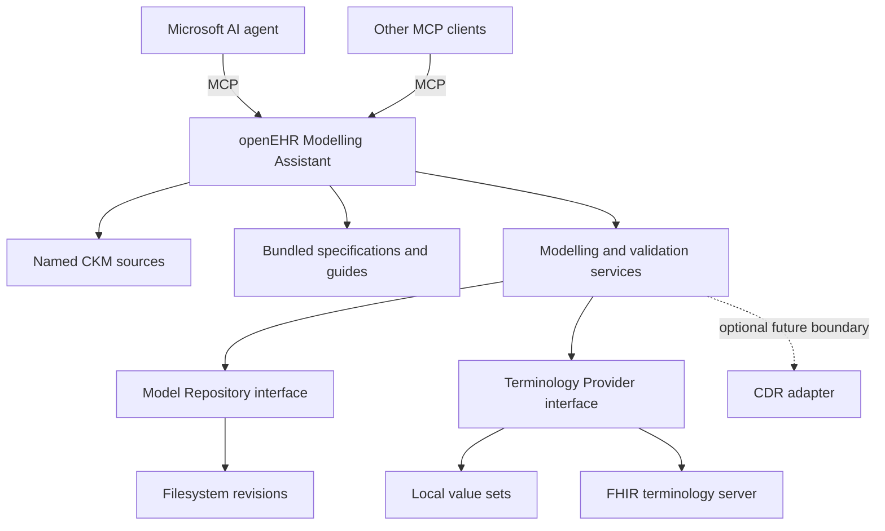

# openEHR Modelling Assistant

A self-hosted, configurable openEHR knowledge and modelling service for AI agents.
It helps clinical information modellers and engineers find source archetypes,
draft templates, review ADL and AQL, manage modelling artefacts, and verify
terminology. **A CDR is not required for modelling.**

Microsoft Copilot Studio is the primary documented enterprise consumer. The core
speaks standard MCP and contains no Microsoft, OpenAI or Anthropic model client.
Your agent supplies conversational reasoning, whether its permitted model is
Claude, GPT or another model. This service supplies retrieval and deterministic
operations. It does not provide clinical treatment advice, run an EHR, replace
CKM, or operate as a terminology server.

## What it can do

- Search and retrieve archetypes and templates directly from multiple configured CKMs.
  Select a named international, national or organisational CKM on each call.
- Supply bundled openEHR specifications, modelling guides, examples and terminology.
- Guide archetype, template, ADL, AQL and simplified-format design/review through MCP prompts.
- Generate a **draft OET** containing a retrieved COMPOSITION and direct ENTRY archetypes,
  retaining actual CKM source identifiers and content hashes.
- Parse XML securely; check an OET/OPT structural profile and ADL headers; compare XML
  structure, constraints and leaf values. These checks do not certify openEHR conformance.
- Persist projects, requirements, artefacts, decisions, metadata and immutable revisions
  using a filesystem provider with conflict detection.
- Represent local/external value sets and bindings, invoke FHIR terminology operations,
  compare terminology changes, and produce declared terminology dependency manifests.
- Report explicit requirements traceability and a QA preflight that identifies unexecuted checks.

There is **no OPT compiler, complete ADL/AQL validator, CDR execution adapter,
visual modeller, GitHub/GitLab/SharePoint storage adapter, or operational approval UI**.
The interfaces and governance policy prepare these extensions. OIDC/Entra token
verification is an extension point; `AUTH_MODE=oidc` fails closed until implemented.
See the [capability matrix](CAPABILITIES.md) and [verification report](docs/IMPLEMENTATION_REPORT.md).

## Start locally

Requires Docker Engine and Docker Compose with `env_file.required` support.
Linux containers can run on Linux or Docker Desktop on macOS/Windows; the executable
verification environment is recorded in the evidence report.

```sh
git clone https://github.com/CzarMich/openehr-modelling-assistant.git
cd openehr-modelling-assistant
cp .env.example .env
docker compose up -d --build
curl http://127.0.0.1:8343/health
curl http://127.0.0.1:8343/ready
```

Connect a Streamable HTTP MCP client to `http://127.0.0.1:8343/mcp`.
The example configuration is local development with no authentication and a loopback
port binding. Enterprise deployment requires authenticated HTTPS through a gateway.
Read [deployment](docs/DEPLOYMENT.md), [configuration](docs/CONFIGURATION.md),
and [security](docs/SECURITY.md) before changing the exposure.

## Agent integration and MCP tools

[Microsoft integration](docs/MICROSOFT_AGENT_INTEGRATION.md) documents Copilot Studio,
Microsoft Agent Framework and Foundry, with tenant tests explicitly distinguished
from repository-side tests. [Generic MCP clients](docs/MCP_CLIENTS.md) covers HTTP
and stdio. [Tool catalogue](docs/MCP_TOOLS.md) contains generated signatures,
return schemas, examples and dependency/failure notes for every exposed tool.

- `guide_get` returns the **full** guide file.
- Existing CKM, guide, example, type-specification and terminology tool names remain stable.
- New project writes require `MODEL_REPOSITORY_WRITE_ENABLED=true`; no MCP tool can approve or release a model.

## Architecture and workflows



Start with the [neonatal modelling workflow](workflows/neonatal-admission.md),
[architecture](docs/ARCHITECTURE.md), [model repository](docs/MODEL_REPOSITORY.md),
[terminology](docs/TERMINOLOGY.md) and [governance](docs/GOVERNANCE.md).
AQL creation/review uses the agent plus grounded prompts and paths; execution is not implemented.

## Development and testing

```sh
make env
make build-dev
make install
make ci
```

Run PHP and Composer inside the development container. Unit tests use mocked
external dependencies. [Testing](docs/testing.md) separates deterministic tests,
MCP/container checks and opt-in live probes. [Baseline audit](docs/BASELINE_AUDIT.md)
records the unmodified upstream results. [Migration](docs/WHITE_LABEL_MIGRATION.md)
records intentional changes and every remaining upstream vendor reference.

## Licence and attribution

The upstream MIT copyright is retained verbatim in [LICENSE](LICENSE), with
[third-party notices](THIRD_PARTY_NOTICES.md). The product name, vendor, descriptions,
URLs and logo are deployment configuration. Branding does not change openEHR standards
or imply authorship of upstream components, EY certification or clinical validation.
