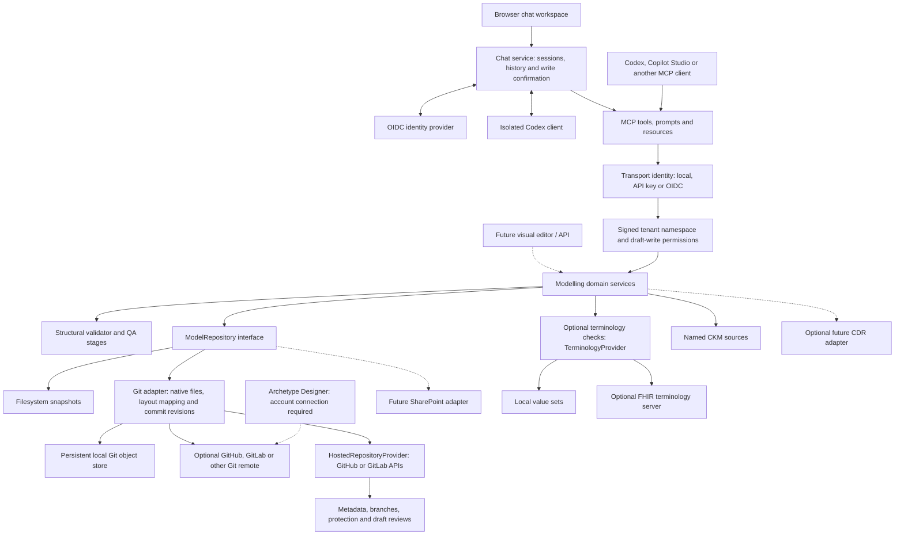

# Architecture

openEHR Modelling Assistant is a PHP 8.4 application. MCP is its current interface; the modelling domain has no Microsoft, Claude, OpenAI, GitHub, GitLab or Graph SDK dependency. Clients supply the language model and orchestration. The application provides deterministic retrieval, persistence and bounded checks.

Solid edges are implemented; dotted edges are extension boundaries. `src/Domain` owns modelling, terminology, traceability and repository contracts. `src/Integrations` implements filesystem, Git and FHIR adapters. The generic Git adapter supports hosted GitHub/GitLab repositories without a hosting-provider SDK. Optional hosting adapters implement `HostedRepositoryProvider`; `src/Application/RepositoryService` supplies transport-independent operations and write authorization. Hosted metadata is scoped to the configured tenant repository; draft reviews cannot approve clinical models. The dotted Designer edge represents an account-specific integration that still needs a hosted Designer round-trip acceptance test. `src/Apis` implements CKM retrieval. `src/Tools` adapts domain calls to closed MCP schemas. `public/index.php` supplies authentication, transport, discovery, sessions and redacted logging.

The HTTP path is enterprise TLS gateway → Caddy → private PHP-FPM → MCP handler. stdio uses the same discovery and domain services with local process permissions. CDR credentials and terminology-server configuration are unnecessary for startup, retrieval, draft generation, persistence or local structural validation. Models need no terminology binding. An explicitly requested external terminology check returns `NOT_EXECUTED` when no server is configured; local value sets remain usable.

Model files, local value sets, binding records, requirements and decisions share one repository. Select `filesystem` for atomic JSON project snapshots, or `git`/`github`/`gitlab` for ordinary model files, Git commits and optional remote synchronization. Both use expected revisions to reject stale updates. Git fetches before writes and accepts a commit locally only after its remote push succeeds; a rejected push leaves the accepted local branch unchanged. Each instance needs its own Git cache. Native OIDC partitions local storage by issuer/tenant and maps separate Git remotes per tenant. API-key mode remains a shared service principal. Automatic conflict merge, distributed locking and a search index are separate work.

XML parsing is deterministic. OET/OPT checks cover a documented structural subset; ADL checks inspect its header; AQL parsing/execution and OPT compilation are unavailable. QA records those stages as NOT_EXECUTED and keeps release eligibility false. Domain governance policy cannot turn an AI-supplied approval field into a release.

Source selection is deployment-controlled. Each CKM tool accepts a configured source name; it cannot accept an arbitrary destination URL. See [configuration](CONFIGURATION.md), [repository](MODEL_REPOSITORY.md), [terminology](TERMINOLOGY.md), [governance](GOVERNANCE.md), and the [capability matrix](../CAPABILITIES.md).

The optional [browser chat](BROWSER_CHAT.md) is a separate Node MCP client with a pinned Codex runtime. It keeps provider/MCP credentials server-side and requires exact-change confirmation for repository writes. Browser OIDC authenticates chat users independently of native MCP bearer verification; neither boundary yet supplies project-level RBAC. Conversation storage is private to each signed-in identity, while the configured model repository may be shared.
