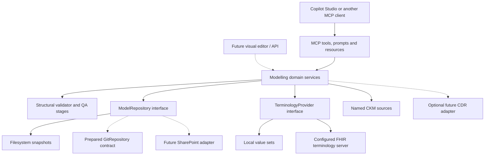

# Architecture

openEHR Modelling Assistant is a PHP 8.4 application. MCP is its current interface; the modelling domain has no Microsoft, Claude, OpenAI, GitHub, GitLab or Graph SDK dependency. Clients supply the language model and orchestration. The application provides deterministic retrieval, persistence and bounded checks.

Solid edges are implemented; dotted edges are extension boundaries. `src/Domain` owns modelling, terminology, traceability and repository contracts. `src/Integrations` implements filesystem and FHIR adapters. `src/Apis` implements CKM retrieval. `src/Tools` adapts domain calls to closed MCP schemas. `public/index.php` supplies authentication, transport, discovery, sessions and redacted logging.

The HTTP path is enterprise TLS gateway → Caddy → private PHP-FPM → MCP handler. stdio uses the same discovery and domain services with local process permissions. CDR credentials are unnecessary for startup, retrieval, draft generation, persistence or local validation.

Model files, local value sets, binding records, requirements and decisions share one repository. A project is stored atomically as a JSON snapshot with logical artifact paths and immutable revisions. This is suitable for a single application instance; replicated storage, distributed locks, database migrations, search indexing and tenant partitioning are not implemented.

XML parsing is deterministic. OET/OPT checks cover a documented structural subset; ADL checks inspect its header; AQL parsing/execution and OPT compilation are unavailable. QA records those stages as NOT_EXECUTED and keeps release eligibility false. Domain governance policy cannot turn an AI-supplied approval field into a release.

Source selection is deployment-controlled. Each CKM tool accepts a configured source name; it cannot accept an arbitrary destination URL. See [configuration](CONFIGURATION.md), [repository](MODEL_REPOSITORY.md), [terminology](TERMINOLOGY.md), [governance](GOVERNANCE.md), and the [capability matrix](../CAPABILITIES.md).
