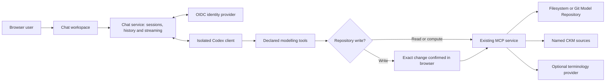

# Chat with the modelling assistant

Open the [development chat](https://dev-openehr-modelling.sandbox.hygeoniq.com/chat/) and select **Sign in to start chatting**. Sign in through the organisation's identity provider. No terminal, MCP configuration or API key is needed in the browser. The development instance uses its configured Codex account to answer questions and call the modelling tools.

## Using the workspace

- Start with a suggested question or type your own. Enter sends; Shift+Enter adds a line.
- Ask to find an archetype, explain modelling guidance, inspect a project, review a draft or plan a template. For example: “List the available CKM sources and find a blood pressure archetype.”
- Replies stream into the conversation. Activity badges show actual modelling-tool calls and whether they completed or failed. Follow source links and copy code blocks or responses as needed.
- Continue with a follow-up question. Previous user/assistant messages supply conversational context; older context is bounded, so restate important details in a long discussion.
- Use **New conversation** for another topic. Conversations are private to the signed-in identity and can be reopened or deleted from the sidebar. The model repository can be shared with other authorised users.
- When writes are enabled, review the exact proposed project/artifact change and select **Confirm save** or **Cancel change**. Every write requires a separate confirmation. Revision conflicts are returned by the existing repository adapter. Confirming a draft save does not approve or release a model.
- **Stop response** cancels further processing. A write already completed remains in repository history. Sign out ends this browser's chat session and stops that user's active turns; it does not globally sign out of other organisational applications.

Terminology servers and bindings remain optional. The chat uses the same bounded structural checks and draft generation as other MCP clients. It does not add full ADL/AQL validation, an OPT compiler, a visual archetype editor, CDR execution or clinical approval. Use modelling examples and synthetic data in the development environment.

## Architecture



The Node chat service is a separate MCP client. PHP modelling services stay client-neutral. Codex receives a bounded transcript and explicitly declared modelling tools. Shell execution, image tools, external apps and agent delegation are disabled; unhandled permission requests are rejected. Its code-mode helper supports tool dispatch within the isolated container. The container has no application source checkout, host workspace, Docker socket or model-storage mount. The browser receives neither the MCP key nor the model-provider credential. Codex account credentials stay in its private runtime volume.

The adapter uses the [official Codex app-server protocol](https://learn.chatgpt.com/docs/app-server). Its dynamic-tool interface is experimental, so the runtime version is pinned and protocol changes need testing before upgrades. The identity client uses [openid-client](https://github.com/panva/openid-client), with authorization code flow, PKCE, state, nonce and ID-token signature/issuer/audience/time verification.

## Deploying browser chat

The default Compose stack builds the chat image but keeps chat disabled until configured. MCP remains available independently. Caddy forwards `/chat` and `/chat/*` to the private chat service; only the existing ingress port is published. The root introduction page links to the chat workspace.

1. Copy `.env.chat.example` to a protected external environment file. Set `MODELLING_CHAT_ENV_FILE` to its absolute path when running Compose. Keep it outside Git and restrict it to the deployment account.
2. Register a confidential OIDC client with authorization code flow and PKCE S256. Register the exact redirect URI `https://<modelling-host>/chat/auth/callback`; use the site's exact origin for permitted web origins. Password grants, implicit flow and service accounts are unnecessary for browser sign-in.
3. Set the public URL, issuer, client ID and secret. Optionally restrict admission with `CHAT_ALLOWED_GROUPS`; configure a signed `groups` claim in the ID token. An empty list admits authenticated users of the configured issuer.
4. Set the fixed MCP URL and its service key. For Docker-internal HTTP, include the internal hostname in `MCP_ALLOWED_HOSTS`; HTTPS must verify the endpoint's certificate. Browser requests never choose the upstream URL or header.
5. Provision a Codex account for this service. Mount a protected initial `auth.json` at `/run/secrets/codex-auth.json:ro`. Startup copies it into the dedicated `chat-codex` volume only when that volume has no credential; token refresh updates the runtime copy. Reauthentication/rotation requires replacing the runtime credential and restarting the service. Do not mount the administrator's entire Codex directory or share personal workspace tools. The development setup uses the already authorised local account; this is not evidence of enterprise provider approval or a separate account for every browser user.
6. Enable `CHAT_ENABLED=true`. Enable `CHAT_ALLOW_WRITES=true` only if model writes are intended and also enabled on the MCP service. The browser confirmation remains mandatory when writes are enabled.
7. Run `docker compose up -d --build --wait`, verify Keycloak sign-in in an actual browser, ask for a CKM lookup, inspect the tool activity and verify that the response uses real results. A healthy container alone does not prove the provider account can generate a reply.

`deploy/compose.chat-dev.yml` documents the development credential/CA mounts and local identity routing. Layer it over the normal development, gateway and Git-secret Compose files. It uses `MODELLING_CHAT_ENV_FILE`, `MODELLING_CODEX_AUTH_FILE` and `MODELLING_CA_FILE`. The development CA must be trusted by browsers, Node and the provider runtime; certificate verification stays enabled. Hosted clients do not inherit a workstation's hosts file.

## Configuration

These settings belong to the optional chat service, not PHP `Settings` or inbound MCP authentication.

| Variable | Default | Purpose |
|---|---|---|
| `CHAT_ENABLED` | `false` | Enable authenticated browser conversations |
| `CHAT_PUBLIC_URL` | `http://localhost:8350` | Exact browser origin; HTTPS required except explicit loopback development |
| `CHAT_OIDC_ISSUER` | empty | Pinned HTTPS identity issuer |
| `CHAT_OIDC_CLIENT_ID` | empty | Confidential browser application's client identifier |
| `CHAT_OIDC_CLIENT_SECRET` | empty | Server-side client credential |
| `CHAT_ALLOWED_GROUPS` | empty | Comma-separated allowed signed ID-token groups; empty admits issuer users |
| `CHAT_MCP_URL` | `http://ingress:8343/mcp` | Fixed modelling-service endpoint |
| `CHAT_MCP_API_KEY` | empty | Server-side service credential, if required by MCP |
| `CHAT_MCP_API_KEY_HEADER` | `X-API-Key` | MCP credential header |
| `CHAT_ALLOW_WRITES` | `false` | Expose project/artifact writes with per-call browser confirmation |
| `CHAT_MODEL` | `gpt-6-sol` | Model available to the configured Codex account |
| `CHAT_TURN_TIMEOUT_SECONDS` | `240` | Turn timeout, bounded to 30–600 seconds |
| `CHAT_DATA_DIR` | `/data/chat` | Private conversation storage |
| `CHAT_CODEX_WORK_DIR` | `/workspace` | Empty isolated working directory |
| `CHAT_CODEX_BINARY` | `codex` | Administrator-controlled executable, never a browser parameter |
| `CHAT_PORT` | `8350` | Private HTTP listener |
| `MODELLING_CHAT_ENV_FILE` | `.env.chat` | Compose environment file path |

Sessions use opaque HttpOnly, SameSite cookies, Secure on HTTPS. Mutations require a same-origin request and session-bound CSRF token. Login state is single-use. Sessions last one hour and do not survive chat-service restart. Conversations persist across restart, expire after 30 days without activity and are pruned at startup and hourly. Limits include 100 conversations per user, 80 messages per conversation, 8,000 characters per submitted message, 16 tool calls per turn, three simultaneous turns and 10 message submissions per user per minute. Long transcripts and tool outputs are bounded. The current deployment is one organisation and one shared modelling-service principal; per-project user RBAC remains separate work.

Back up `chat-data` as private application data. Protect `chat-codex` as credential storage. User deletion and retention remove active conversation files; backup retention is an operator responsibility. Provider account data handling and retention follow that account's configuration. Application logs omit prompts, replies and credentials.

## Repeatable verification

```sh
npm ci --prefix chat
npm --prefix chat test
cd chat
npx playwright install --with-deps chromium
npm run test:browser
```

Security tests exercise identity signatures/claims, state replay, group restrictions, sessions, CSRF, cross-user conversation access, tool allowlists, exact write confirmation, cancellation, provider protocol and retention. Browser tests use a clearly separated deterministic fixture and cover sign-in UX, streaming, history, code rendering, write confirmation, cancellation, mobile layout and untrusted markup. The fixture is excluded from the runtime image. Live development verification uses the actual identity provider, Codex account and MCP service; see the implementation report and evidence. Native MCP bearer-token verification is a separate [implemented identity adapter](OIDC.md); the browser client retains its explicitly configured upstream credential.

To check the configured container's three-turn concurrency limit with actual provider and read-only MCP calls, run from the repository root:

```sh
docker exec -i openehr-modelling-dev-chat-1 node --input-type=module < chat/test/live-concurrency.mjs
```

This probe uses the configured provider account and reports successful turns and container task limits without printing conversation content or credentials. The container allows 512 tasks; each provider process limits its Tokio and Rayon worker pools to two threads. This avoids exhausting the process/thread allowance on hosts with many CPU cores.
