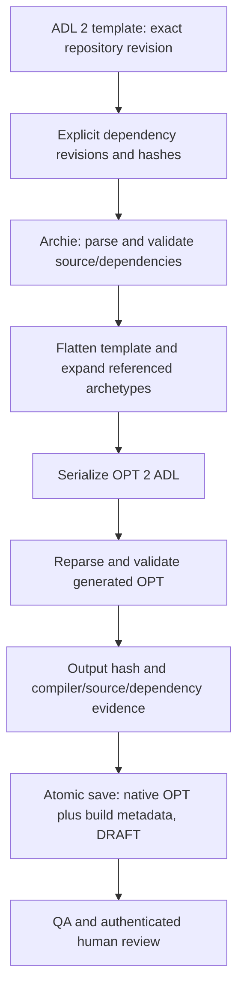

# OPT compilation and native validation

The assistant compiles **ADL 2 templates into OPT 2 in ADL serialization** using Archie 3.20.0. Compilation is deterministic computation, available to browser chat and any MCP client when the optional engine is configured. It needs neither an LLM nor a terminology server/CDR. Legacy Ocean OET XML and legacy OPT 1.4 XML are different formats; this compiler does not convert those formats or Designer `.t.json` authoring files.

## Operations

| Tool | Input and result |
|---|---|
| `archetype_validate` | ADL 2 source plus explicit dependencies; native parse, AOM and declared RM checks |
| `template_validate` | ADL 2 template plus explicit dependencies; source/dependency validation |
| `template_compile` | Validated ADL 2 template/dependencies; generated OPT 2 ADL, SHA-256, native findings and compiler/dependency evidence |
| `opt_validate` | Standalone OPT 2 ADL; parse and scoped native flat AOM/RM checks |
| `model_inspect` | Validated ADL 2 or OPT 2; actual paths, types, multiplicities and terminology |
| `aql_validate` | Native AQL grammar/AST and normalized query; no CDR required |
| `template_compile_project` | Exact repository template and dependency revisions; new DRAFT OPT with build metadata in one atomic repository save |

Every response separates operation success from validation: inspect `result.valid`, `status`, `completed_stage`, `profile` and `findings`. Errors include `ENGINE_NOT_CONFIGURED`, `ENGINE_DEPENDENCY_ID_MISMATCH`, `ENGINE_DEPENDENCY_AMBIGUOUS`, `ENGINE_ADL_VERSION_UNSUPPORTED`, `ENGINE_TIMEOUT` and `ENGINE_BUILD_CONFLICT`. Missing dependencies, unresolved slots/internal references and parser recovery cannot produce a successful compiled output. The `checks` map names completed and unexecuted stages.

## Build workflow



1. Import or save the unchanged ADL 2 template and archetypes using `model_artifact_save`. Read their exact repository revisions.
2. Call `template_compile` for computation only, or `template_compile_project` to save a build. Each dependency uses the same declared RM release as the source and declares its actual full identifier; content hashes are calculated and checked at the service boundary. An unambiguous major-version reference may resolve to its explicitly supplied full edition. Multiple candidate editions are rejected. No implicit CKM download or newer-version substitution occurs.
3. Read the generated native OPT from `templates/compiled/<build-id>.opt`. Its sidecar repository metadata contains `build`: source path/revision/hash, dependency identifiers/revisions/hashes, engine/profile/RM versions, output digest, timestamp, transport actor and validation findings. The native model text contains no platform metadata.
4. Request QA/review separately. Compilation never approves or publishes a model. The existing governance validation provider still uses its own qualification gate; repository build metadata is not a signed governance attestation.

`template_compile_project` may deliberately compile a historical revision. Later source edits do not alter that build. A build identifier includes canonical input references, compiler identity and output hash. Retrying the same build reuses its revision; conflicting content fails. The service never overwrites an existing build. Filesystem/Git/SharePoint retain their normal history and administrator trust boundaries; build files are not a separate WORM storage system.

Example saved build request (replace revision placeholders with actual results):

```json
{
  "name": "template_compile_project",
  "arguments": {
    "project": "modelling-demo",
    "path": "templates/fixture.adlt",
    "revision": "<template-revision>",
    "dependencies": [{
      "identifier": "openEHR-EHR-COMPOSITION.engine_fixture.v1.0.0",
      "path": "archetypes/composition.adls",
      "revision": "<dependency-revision>"
    }]
  }
}
```

The synthetic sources are in `engine/src/test/resources`. They demonstrate the compiler contract; they are not approved clinical models.

## Deployment

The core works without the engine; native operations then return `ENGINE_NOT_CONFIGURED`. To enable the isolated sidecar:

```sh
install -d -m 700 .secrets
python3 - <<'PY'
import pathlib, secrets
p = pathlib.Path('.secrets/engine-key')
if not p.exists():
    p.write_text(secrets.token_hex(32))
    p.chmod(0o444)
PY
export MODELLING_ENGINE_KEY_FILE="$PWD/.secrets/engine-key"
docker compose -f docker-compose.yml -f deploy/compose.engine.yml up -d --build --wait
```

Keep the parent secret directory private. `.secrets` is ignored by Git. The overlay mounts the same read-only service credential into PHP and the engine and sets `OPENEHR_ENGINE_URL=http://127.0.0.1:8090`. The engine shares the app's network namespace; it publishes no host port. Pin the selected image/digest under your release policy. The standard server deployment includes this overlay when its protected `config/engine-key` exists.

| Variable | Default | Meaning |
|---|---|---|
| `OPENEHR_ENGINE_URL` | empty | Disabled, exact local origin above, or a trusted HTTPS origin without path/userinfo |
| `OPENEHR_ENGINE_KEY_FILE` | empty | Absolute readable file containing 64–128 lowercase hex characters; optional final newline |
| `OPENEHR_ENGINE_TIMEOUT` | `50` | PHP request timeout, 1–60 seconds |
| `MODELLING_ENGINE_KEY_FILE` | required by overlay | Host path mounted into both containers |
| `MODELLING_ENGINE_IMAGE` | `openehr-modelling-engine:local` | Compose image name; built from the repository by default |
| `ENGINE_KEY_FILE` | `/run/secrets/engine-key` | Engine process credential path; restart the engine when rotating it |

Requests are limited to 2 MiB per model, 64 dependencies, 8 MiB combined request and 16 MiB response. Two worker JVMs run concurrently, each with a 512 MiB heap and 45-second deadline. Busy requests receive a bounded failure. Saved outputs must fit the repository's 2 MiB artefact and 64 KiB metadata limits. Every operation uses a fixed endpoint and receives content, never arbitrary code, files or retrieval URLs. Source model text must not be used as deployment credentials.

## Supported profiles and limits

- ADL 2.0, 2.0.0, 2.0.5 and 2.0.6 declarations; AOM 2 with bundled openEHR RM profiles 1.0.2, 1.0.3, 1.0.4 and 1.1.0. Fixtures exercise RM 1.0.4; other bundled releases require model-specific acceptance before a deployment claims support for its model catalogue.
- Nested referenced archetypes are expanded and checked with their local terminology scopes. The OPT checker requires embedded root terminology in the template's language; it does not invent missing translations. Original source bytes and compiler serialization are preserved.
- AQL parsing uses openEHR SDK 2.35.0. Syntax validity does not prove path validity, model compatibility or successful query execution; those checks remain explicitly unexecuted.
- External terminology membership, clinical suitability, comprehensive rule execution, composition validation and production release qualification are separate checks. A mechanically valid OPT is not an approved clinical model.
- Legacy OET-to-OPT 1.4 compilation, Designer import acceptance and full semantic cross-compiler comparison are not delivered by the ADL 2 adapter. `.t.json` remains a distinct authoring artefact. See [Designer compatibility](ARCHETYPE_DESIGNER_COMPATIBILITY.md).

## Repeatable verification

Run `make engine-check` (Docker). It builds the real Java/PHP containers and exercises MCP discovery, source/dependency validation, compilation, output revalidation, deterministic rebuilds, saved evidence, native inspection and AQL syntax without external services. Transport probes cover service authentication, Host/Origin rejection, unknown operations, ambiguous/trailing JSON, oversized requests and credential non-disclosure. Java tests include nested EVALUATION/CLUSTER compilation, missing terminology and invalid embedded RM constraints. PHP contracts cover source revisions, failed-build non-persistence, disabled writes, tampering and idempotency across filesystem and Git.

Execution evidence lives in `docs/evidence/ci-engine-smoke.json`. The [evaluation](OPENEHR_ENGINE_EVALUATION.md) records engine selection; [ADR-0020](decisions/0020-native-openehr-engine.md) records the boundary and validation adaptation.

The production engine image includes `/app/sbom.json`. CI audits its pinned Maven runtime components against OSV using `scripts/audit-engine-dependencies.py`; known-advisory results are recorded separately from functional acceptance.

The build report retains exact native terminology binding URIs with their archetype scope and local code/path. It does not infer a CodeSystem version from an opaque URI or contact a terminology server. External terminology validation is recorded as `NOT_EXECUTED`. Synthetic fixtures exercise nested CLUSTER terms, English/German definitions, annotations and binding preservation across compilation and native OPT reparsing; broader authoring-tool round-trip compatibility still needs separate evidence.
