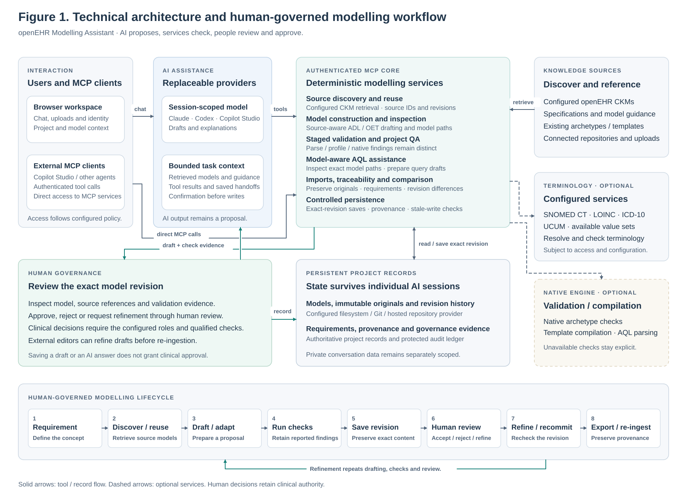

# Architecture figures

Maintained by Michael Anywar.

These SVGs have editable text and shapes, accessible titles and descriptions, and
no external font or image dependencies. Open them in a browser, Inkscape, Figma or
an SVG-capable document editor. Keep the reported optional-service boundaries when
adapting them for a deployment.

## Modelling architecture and human review

[Download the editable SVG](openehr-modelling-architecture.svg).

This replaces the incomplete workflow figure with explicit persistent records,
revision checks, provenance and human clinical review. AI providers propose drafts;
authenticated services retrieve sources, inspect models and apply bounded checks.
Native validation and terminology depend on the configured services. Saving a model
or committing to Git does not establish clinical approval. See the
[implementation architecture](../ARCHITECTURE.md), [governance](../GOVERNANCE.md),
[validation](../VALIDATION_AND_QA.md) and [repository](../MODEL_REPOSITORY.md).

## Azure and Copilot Studio deployment

[Download the editable SVG](azure-copilot-deployment-architecture.svg).

This shows the initial three-container, single-replica Azure starter, HTTPS MCP
connection, imported immutable images, dedicated model storage and managed-identity
secret references. Chat, authoring and human review require their documented
configuration and acceptance. Follow the [Azure handover](../AZURE_COPILOT_HANDOVER.md)
and [Container Apps example](../../deploy/azure/containerapp.example.yml).
The figure describes a deployment plan; company-tenant acceptance remains required.
