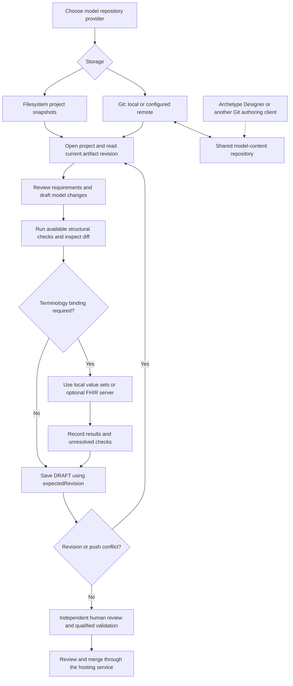

# Shared model repository workflow

Use the same `ModelRepository` tools with either filesystem or Git storage. Filesystem keeps projects in local snapshots. Git keeps native files and commit revisions and can synchronize with GitHub, GitLab or another approved remote. Terminology is optional throughout.

The Designer edge requires account authorization and verified directory/format compatibility; no hosted UI round trip has been completed. Hosted review/merge is an external step, not an assistant approval endpoint.

1. Create a dedicated model-content repository. Retain application source and deployment secrets elsewhere. Create a review branch in Git or the hosting UI.
2. Configure `MODEL_REPOSITORY_PROVIDER=git`, the remote, that branch, and a scoped deploy key with pinned host identities. Mount a persistent cache. See [repository settings](../MODEL_REPOSITORY.md).
3. Open project `default` for the configured content root. Use `MODEL_GIT_CONTENT_PATH=local` when needed, with `MODEL_GIT_LAYOUT=categories` for folders or `flat` for native files directly under that root. MCP still exposes logical paths such as `archetypes/<name>.adl`. Existing files are discovered without metadata changes. For a new empty repository, call `model_project_create` with `id: "default"`. Other project IDs use `projects/<id>/`.
4. Fetch an artifact through `model_artifact_get`, preserving its revision and original content. Retrieve supporting CKM sources and guides. Native authoring JSON stays JSON; an exported OPT is a separate artifact.
5. Review proposed content with `model_diff` where supported and `model_validate`. Neither tool certifies full model semantics. Terminology-free models need no binding records. Local value sets work without a server; requested external checks with no configured server return `NOT_EXECUTED`.
6. Save through `model_artifact_save` with `expectedRevision`. The adapter refreshes the remote, commits native files and pushes without overwriting remote history. Conflicts require rereading and reconciling changes. A failed push does not become an accepted local revision.
7. Preserve reports and requirement links alongside models. Request human review through the hosting service and use a qualified compiler/validator before any operational release. Review branches and commits are not approval evidence.
8. Refresh the authoring client after the reviewed merge. Verify imports/exports against the original model, dependent archetypes, languages, cardinalities and bindings before claiming lossless interoperability.

For an entirely local workflow leave `MODEL_GIT_REMOTE_URL` empty, or select `filesystem`. Choose the repository based on collaboration and backup needs; no terminology or model-provider service is required for either.
